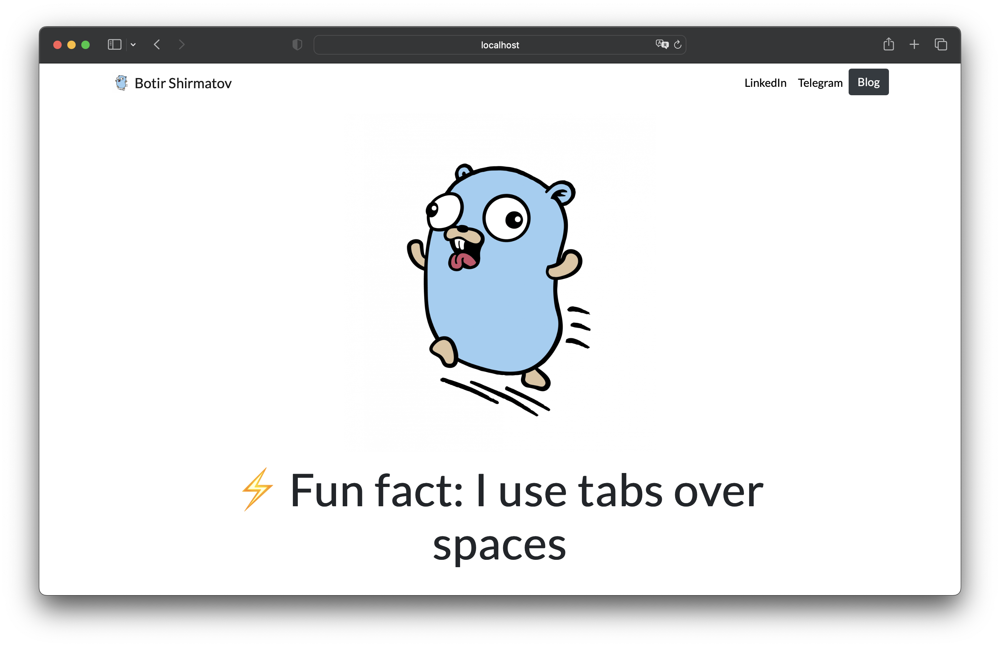
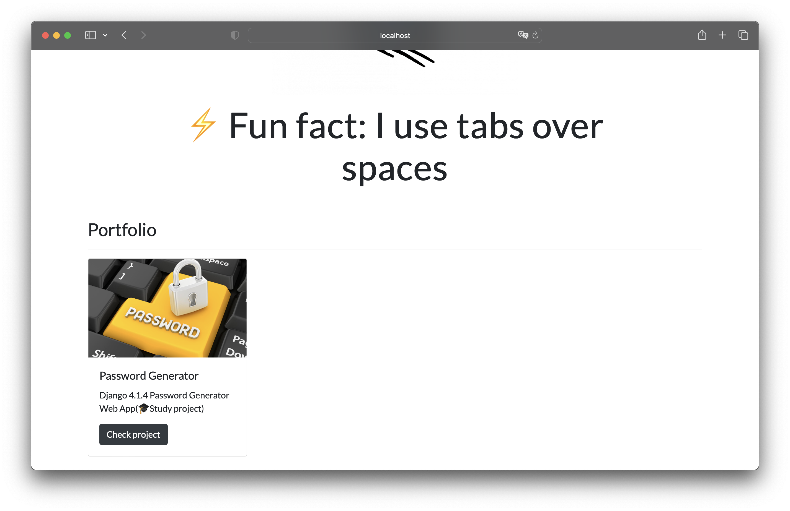
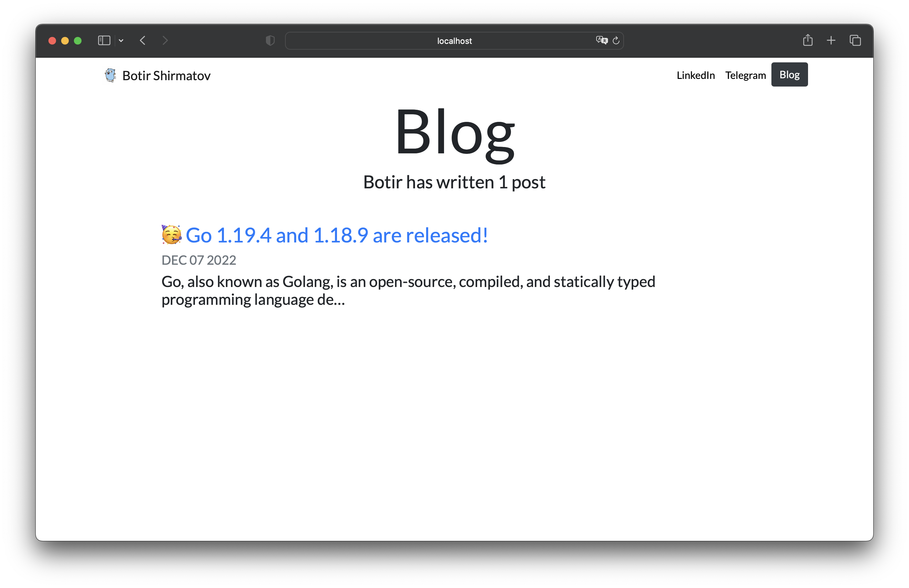
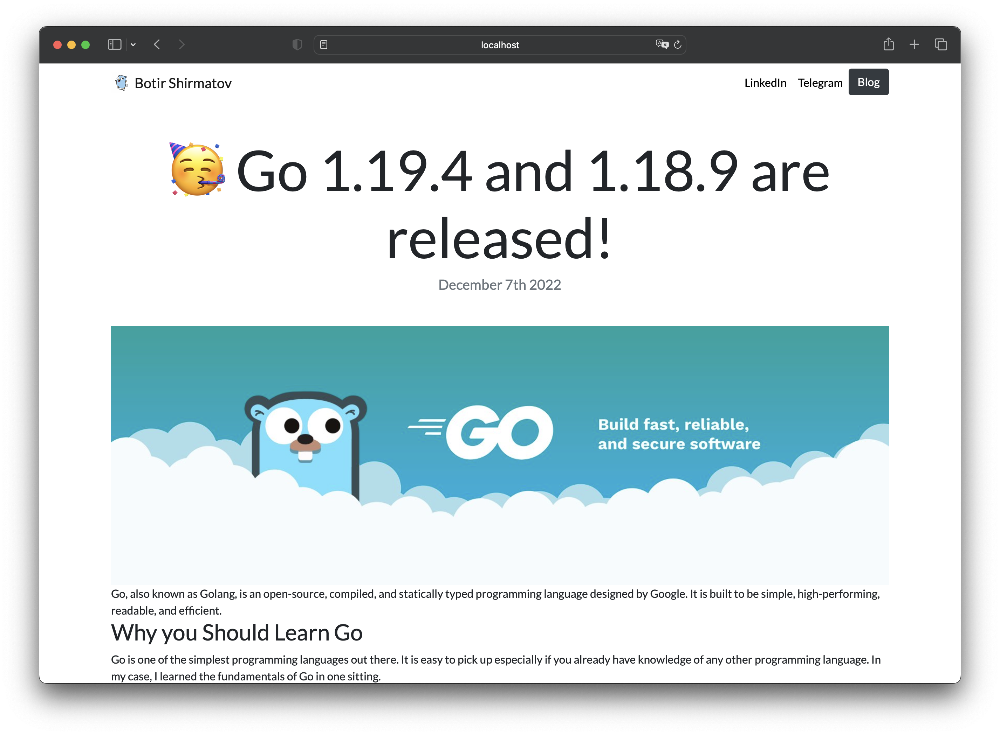

## Personal Portfolio

### Home preview




### Blog preview



### Post preview




## Installation

1. Create the environments file:

```console
python3 -m venv ./.venv/
```

2. Clone project

```console
git clone https://github.com/towiron/personal_portfolio.git
```

3. Install requirements

```console
pip3 install -r /personal_portfolio/requirements.txt
```

4. Create super user:
```console
python3 manage.py createsuperuser
```

5. Run server:
```console
python3 manage.py runserver
```


